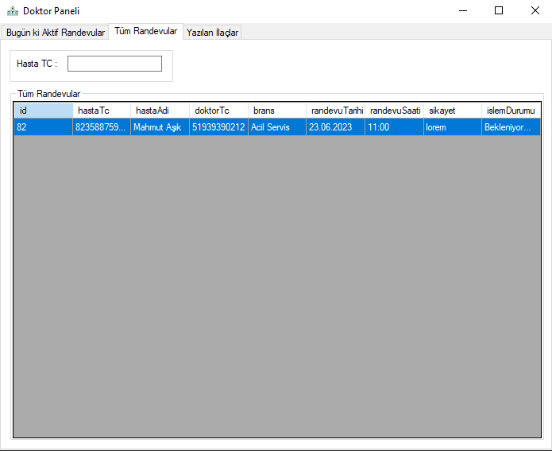

# Hospital-App

```
Patient Registration & Appointment Automation, our final project to finish 2022 university with a team of three.
Developed with Visual Studio C# & MySQL (Xampp).
Required 3rd application: MySQL Connector/NET/C#

After creating dopeca db and importing dopeca.sql, the application will run.
The datas created by random generators.
```
>Admin : admin | admin
>
>Doctor : 33058804900 | 123123
>
>Secretary : 12312319191 | 123123




